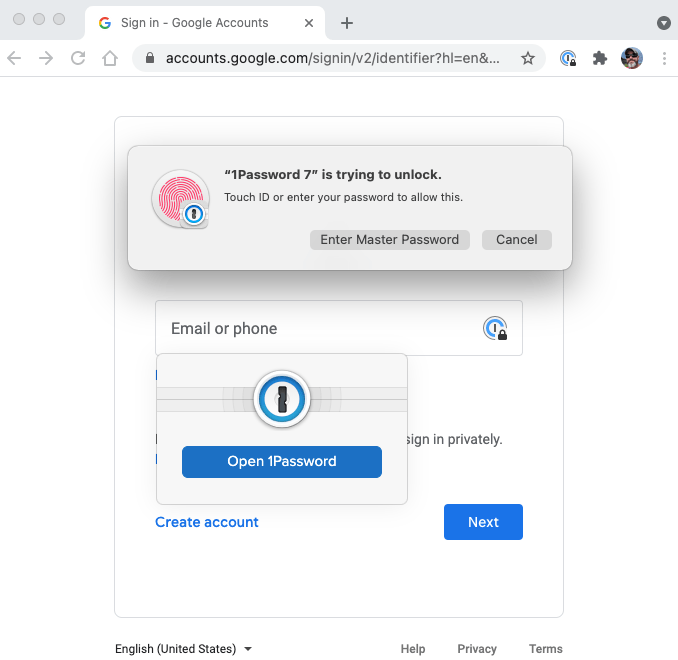

# 🎁 Benefits

## 1Password

[1Password](https://1password.com/) is a popular password manager available for Linux, Windows, macOS, Android, and iOS.

As an open-source project, our team is eligible for a free license which will give you a [personal vault](https://1password.com/sign-up/) along with project vaults.

<figure><figcaption></figcaption></figure>
